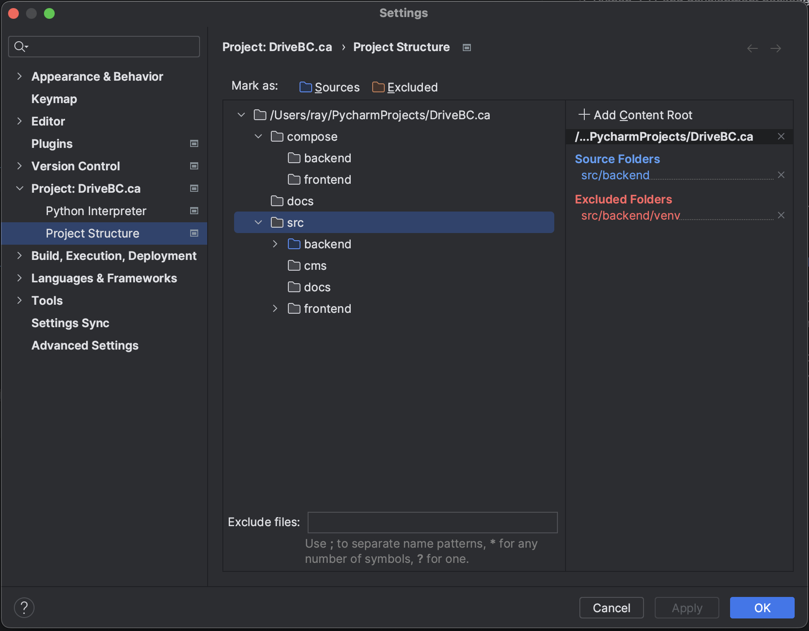
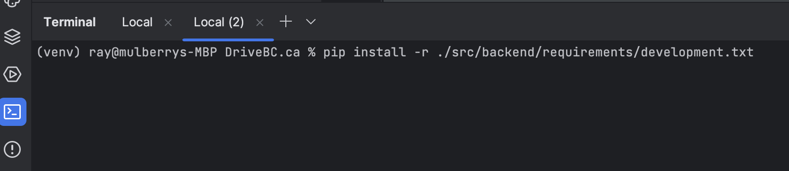
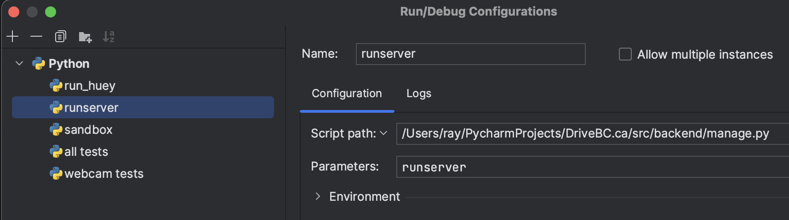
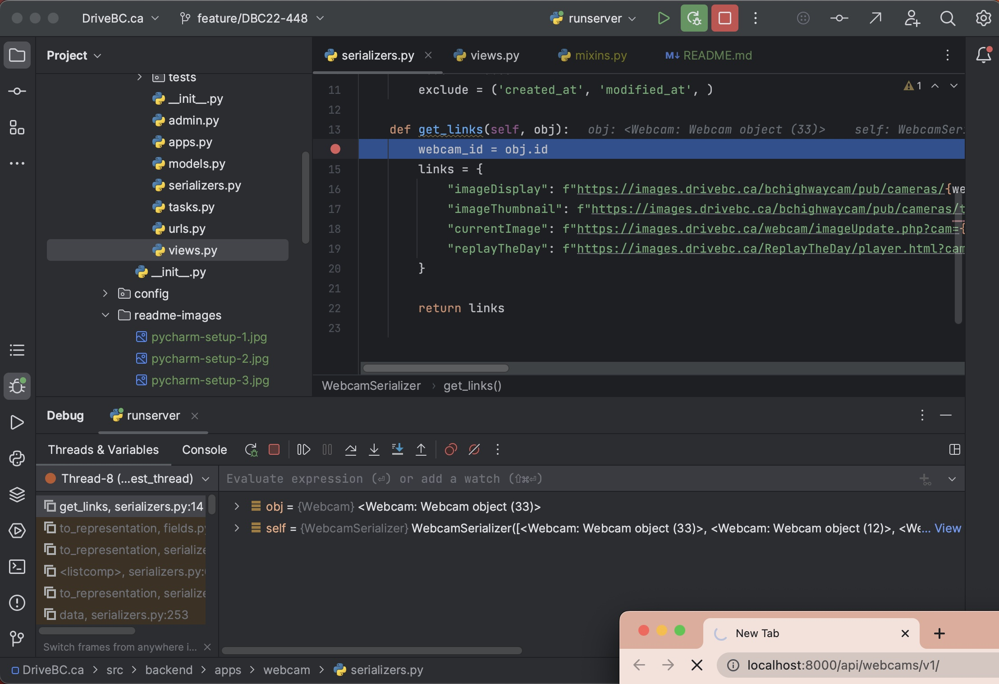

# DriveBC Backend

This page details the steps to set up a local, non-containerized dev environment for our backend Django server.

Using a local python venv is recommended for easier and faster access to server reloads and test modules, as well as direct access to Django management commands through terminal.
**Verify all changes on the docker container before pushing though.**

Alternatively, our Docker images innately supports hot-reloading on code changes. Refer to the [IDE - Pycharm](#ide-pycharm) section for more info.

- [Prerequisites](#prerequisites)
- [Installing required packages](#installing-packages)
- [Database and caching](#database-and-caching)
- [IDE - Pycharm](#ide-pycharm)
  - [Installation](#pycharm-installation)
  - [Git checkout](#pycharm-git-checkout)
  - [Project structure](#pycharm-project-structure)
  - [Virtual environment](#pycharm-venv)
  - [Run configurations and management commands](#pycharm-run-config)
  - [Test coverage and report](#coverage-report)

---

## Prerequisites

- [Python 3.11](https://www.python.org/downloads/)
- [Git](https://git-scm.com/book/en/v2/Getting-Started-Installing-Git)
- [PostGIS](https://postgis.net/documentation/getting_started/)
- [Redis](https://redis.io/docs/getting-started/installation/)
- [Pycharm](https://www.jetbrains.com/pycharm/download/) or [Visual Studio Code](https://code.visualstudio.com/), optional IDE
- [Docker](https://www.docker.com/products/docker-desktop/), optional containerized db and caching

## Installing required packages

MacOS:
1. Homebrew `/bin/bash -c "$(curl -fsSL https://raw.githubusercontent.com/Homebrew/install/HEAD/install.sh)"`
2. Git `brew install git`
3. Python 3.11 and openssl `brew install python@3.11 openssl`

Linux:
1. Git `sudo apt install git`
2. Python 3.11 and development packages `sudo apt-get install python3.11 python3.11-dev libssl-dev libffi-dev`

Windows:
1. [Git](https://git-scm.com/download/win)
2. [Python 3.11](https://www.python.org/downloads/release/python-3114/)

## Database and caching
Install [PostGIS](https://postgis.net/documentation/getting_started/#installing-postgis) and
[Redis](https://redis.io/docs/getting-started/installation/) in your local environment and edit .env with the right
hosts and ports.

Alternatively, comment out the 'django' service in docker-compose.yml, run `docker-compose up` in the root folder, and connect to containers
mapped to the host machine via localhost:5432/localhost:6379.

## IDE - PyCharm

This section details setup for PyCharm run configurations on local Python virtual environments.

Alternatively, see [documentation](https://code.visualstudio.com/docs/containers/debug-python) on setting up debugging
with VS code with  python containers.

### Installation
Install [PyCharm Community Edition](https://www.jetbrains.com/pycharm/download/) for your OS.

### Git checkout
Checkout the repo using [git command line](https://github.com/bcgov/DriveBC.ca.git) or [PyCharm VCS options](https://www.jetbrains.com/help/pycharm/manage-projects-hosted-on-github.html). Open the project with Pycharm at the root folder DriveBC.ca.

### Project structure
Set sources root: in the project panel, right click Drivebc.ca/src/backend -> Mark Directory as -> Sources root. This allows PyCharm to resolve imports in the project. Alternatively, go to Pycharm -> Settings -> Project: DrivebC.ca -> Project Structure:

### Virtual environment
Set up a [virtual environment](https://www.jetbrains.com/help/pycharm/creating-virtual-environment.html#env-requirements). Specifying the 'Dependencies' file should install all required packages in the newly created venv. Otherwise, once the venv is created, run `pip install -r ./src/backend/requirements/development.txt
` in the Terminal tab on the bottom-left.

### Run configurations and management commands
Set up [run configurations](https://www.jetbrains.com/help/pycharm/run-debug-configuration.html#createExplicitly) for various management commands. Use `/.../DriveBC.ca/src/backend/manage.py` for Script path, and the command to be ran in Parameters i.e. runserver:

We can now run/debug the server with breakpoints using the toolbar on the top-right:

Useful management commands to add as run configs. Note that these commands can also be ran manually in console:
`python manage.py runserver`

`runserver` - Starts server at localhost:8000

`sandbox` - Runs custom management command under shared/management/commands/sandbox.py. Any other custom management commands can be added and ran the same way.

`test apps --keepdb` - Runs all test modules. Use apps.app_name or a full module path to run tests specific to an app or module.

The --keepdb option uses an existing test database if it already exists and saves time, but we will need to remove this option when there is a new migration to be applied.

`run_huey` - starts huey worker instance and run all registered tasks on start.

`makemigrations` - creates db migrations, see Django [documentation](https://docs.djangoproject.com/en/4.2/ref/django-admin/#django-admin-makemigrations)

`migrate` - executes db migrations, see Django [documentation](https://docs.djangoproject.com/en/4.2/ref/django-admin/#migrate)

### Test coverage and report
In the terminal tab on the bottom left:
1. Switch to the backend folder `cd src/backend/`
2. `coverage run --source='.' manage.py test apps --keepdb && coverage report`
